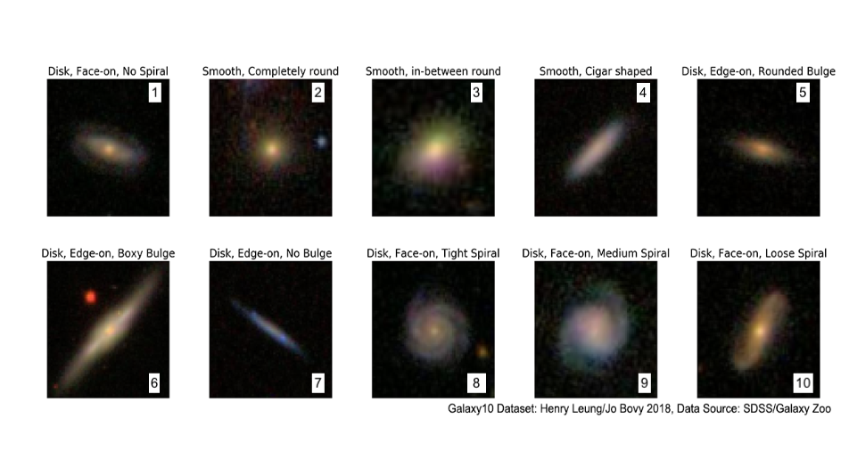
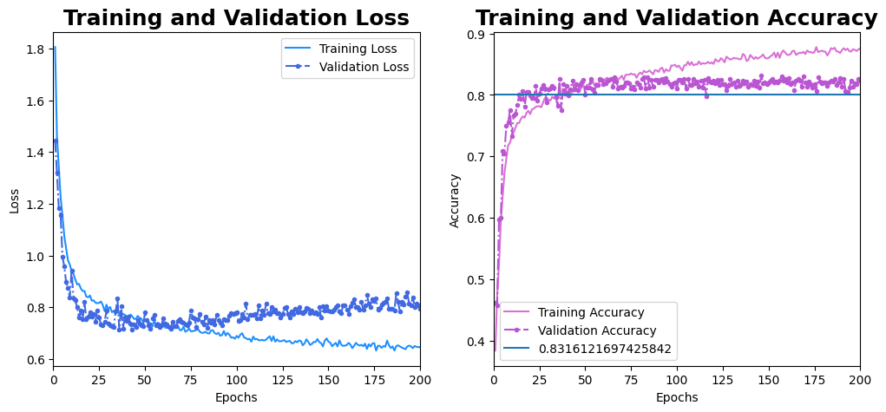
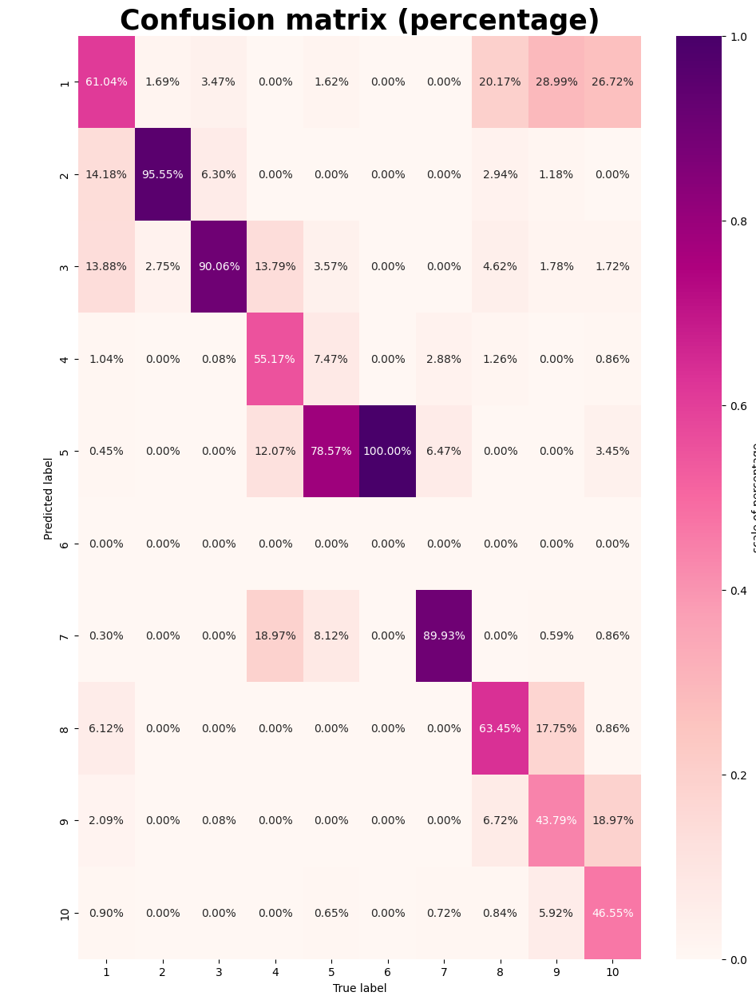

# CNN Galaxy Classification

[](https://www.python.org/)
[](https://www.tensorflow.org/)
[](https://jupyter.org/)

## TL;DR

A Convolutional Neural Network implementation for galaxy morphological classification using SDSS survey data: train a CNN on citizen-scientist classified galaxies from GalaxyZoo, achieve ~90% accuracy across 10 morphological classes.

## Table of Contents

- [Overview](#overview)
- [Dataset](#dataset)
- [Model Architecture](#model-architecture)
- [Requirements](#requirements)
- [Quickstart](#quickstart)
- [Results](#results)
- [About This Project](#about-this-project)
- [References](#references)

## Overview

This project uses Convolutional Neural Networks (CNNs) to perform morphological classification of galaxies from the SDSS survey (Sloan Digital Sky Survey). The galaxies have been morphologically classified using the [GalaxyZoo](https://www.zooniverse.org/projects/zookeeper/galaxy-zoo/) platform through citizen science contributions. The platform presents users with galaxy images alongside typical morphological features (e.g., is it round-shaped? does it have spiral arms? does it have a bar?). Since each galaxy is classified by hundreds of users, this approach provides significantly more robust classifications compared to those derived by individual astronomers or small groups.

## Dataset

This project utilizes images reprocessed by the [`astroNN`](https://astronn.readthedocs.io/en/latest/galaxy10sdss.html) package (see [Gharat & Dandawate, 2022](https://ui.adsabs.harvard.edu/abs/2022MNRAS.511.5120G/abstract), and [Leung and Bovy, 2019](https://ui.adsabs.harvard.edu/abs/2019MNRAS.483.3255L/abstract) for detailed information regarding tagging and image downscaling). 

Below is an example of the images and their classifications:



## Model Architecture

The CNN architecture implemented in `CNN_galaxies.ipynb` consists of:

### Convolutional Layers
- **2 convolutional layers** with 64 filters of 3×3 kernel size + ReLU activation
- **1 max pooling layer** of 2×2 kernel size
- **1 convolutional layer** with 128 filters of 3×3 kernel size + ReLU activation
- **1 max pooling layer** of 2×2 kernel size
- **1 convolutional layer** with 256 filters of 3×3 kernel size + ReLU activation
- **1 max pooling layer** of 2×2 kernel size

### Dense Layers
- **1 dropout layer** with 0.5 dropout rate
- **2 dense layers** with 150 and 60 neurons (Tanh activation)
- **1 output layer** with 10 neurons (Softmax activation) 

## Requirements

- Python 3.8+
- TensorFlow 2.x
- NumPy
- Matplotlib
- Scikit-learn
- Jupyter Notebook

## Quickstart

1. **Clone the repository**
   ```bash
   git clone https://github.com/your-username/CNN_GalClassification.git
   cd CNN_GalClassification
   ```

2. **Install dependencies**
   ```bash
   pip install tensorflow numpy matplotlib scikit-learn jupyter
   ```

3. **Run the notebook**
   ```bash
   jupyter notebook CNN_galaxies.ipynb
   ```

4. **Execute all cells** to train and evaluate the model

> **Note**: Given the model's simplicity and training sample size, this notebook can be executed in Google Colab without additional computational resources.

## Results

### Training Metrics

The plots below show the loss function (left panel) and accuracy (right panel) across training epochs for our CNN model.

**Loss Function**: We use cross-entropy loss, which quantifies classification performance on our training set. The model was trained for 200 epochs. As expected, the loss function decreases dramatically as training progresses. However, around epoch 75, the validation loss begins to slightly increase, suggesting potential overfitting beyond this point.

**Accuracy**: Calculated as the sum of true positives and true negatives divided by the total number of samples. Higher accuracy values indicate better CNN performance. While training accuracy continues to improve, validation accuracy plateaus after approximately 75 epochs, confirming the overfitting hypothesis. Our achieved accuracy values are comparable to those reported in [Gharat & Dandawate, 2022](https://ui.adsabs.harvard.edu/abs/2022MNRAS.511.5120G/abstract).



### Confusion Matrix

The confusion matrix provides detailed insight into the CNN's classification performance. Columns represent true labels, while rows represent predicted labels from the CNN. The numbers correspond to the classifications shown in the dataset figure above.

Perfect classification would result in 100% values along the diagonal and 0% elsewhere. Our results show diagonal values close to 90%, though this varies across different galaxy types. This variation reflects the subtle differences in galaxy morphological classification. For example, class 10 (Disk, Face-On, Loose Spiral) is morphologically similar to class 1 (Disk, Face-On, No Spiral), as evidenced by the ~30% value in cell (1,10) of the confusion matrix.



## About This Project

This code was developed as the final project for the elective course 'Data Analysis for Astronomy' at the UNAM Astronomy Institute during the 2023 fall semester.

**Instructors**: Joel Sanchez and Jorge Barrera  
**Students**: Eric Macías Estrada, Mónica Alejandra Villa Durango, Valeria Quintero Ortega, and Aurora Mata Sánchez

## References

- [Gharat, S. & Dandawate, Y. (2022). Galaxy morphology classification using EfficientNet architectures. *MNRAS*, 511, 5120-5132](https://ui.adsabs.harvard.edu/abs/2022MNRAS.511.5120G/abstract)
- [Leung, H. W. & Bovy, J. (2019). Deep learning of multi-element abundances from high-resolution spectroscopic data. *MNRAS*, 483, 3255-3277](https://ui.adsabs.harvard.edu/abs/2019MNRAS.483.3255L/abstract)
- [Galaxy Zoo Project - Zooniverse](https://www.zooniverse.org/projects/zookeeper/galaxy-zoo/)
- [astroNN Documentation - Galaxy10 SDSS](https://astronn.readthedocs.io/en/latest/galaxy10sdss.html)

## License

This project is available under the MIT License. See the LICENSE file for more details.
